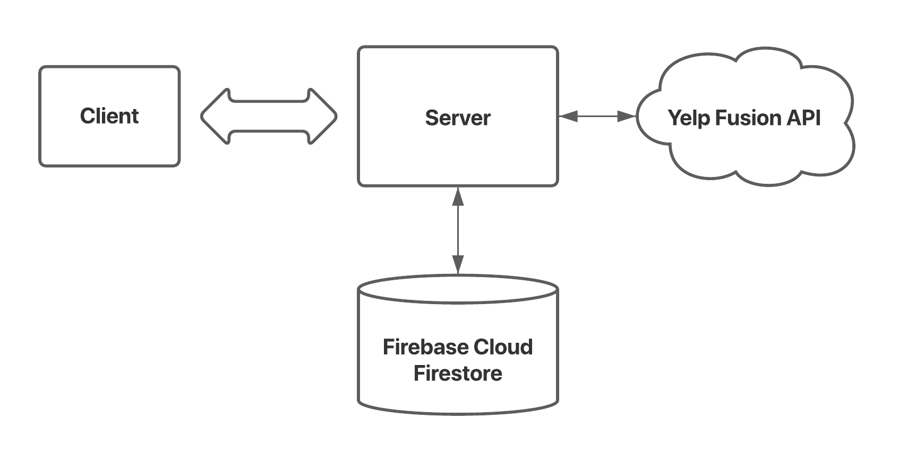

# FoodSpace

FoodSpace is a full-stack web application that streamlines the process of
ordering food. Users can search Yelp for restaurants and schedule plans to eat
there based on their hours of operation on a given day.

## Architecture Overview

FoodSpace is written entirely in JavaScript. The backend is written with
Node.js and Express while the frontend is written in React. The high-level
architecture of FoodSpace is as follows:

